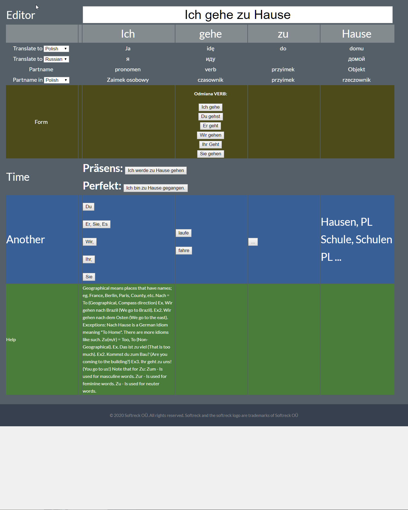
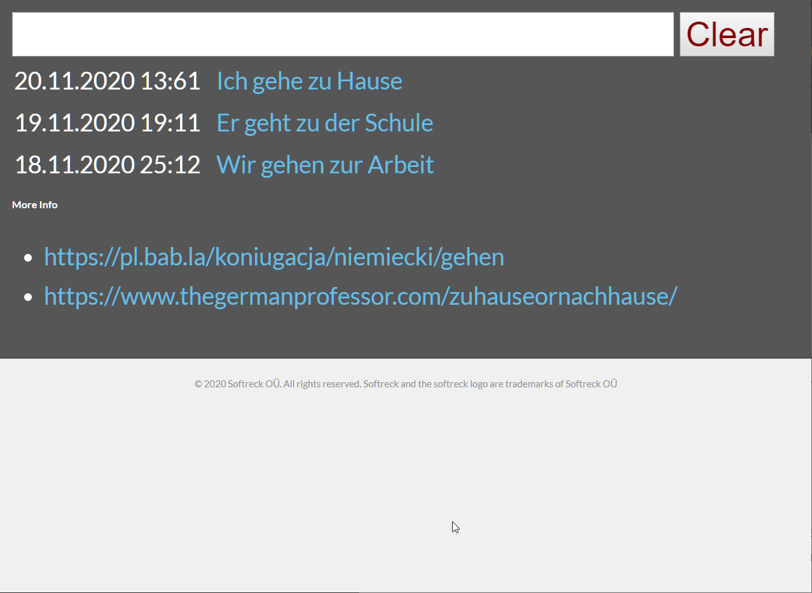
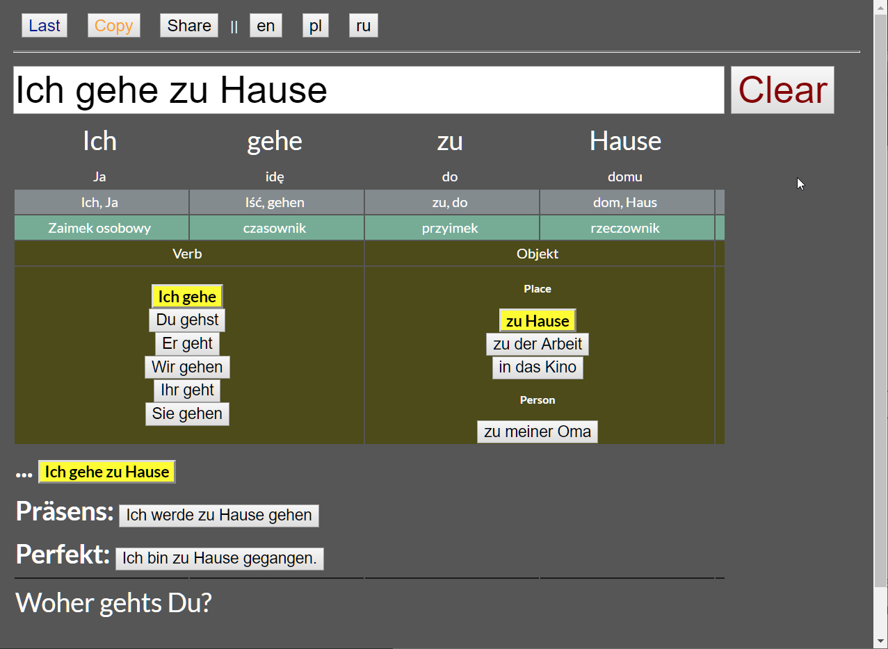
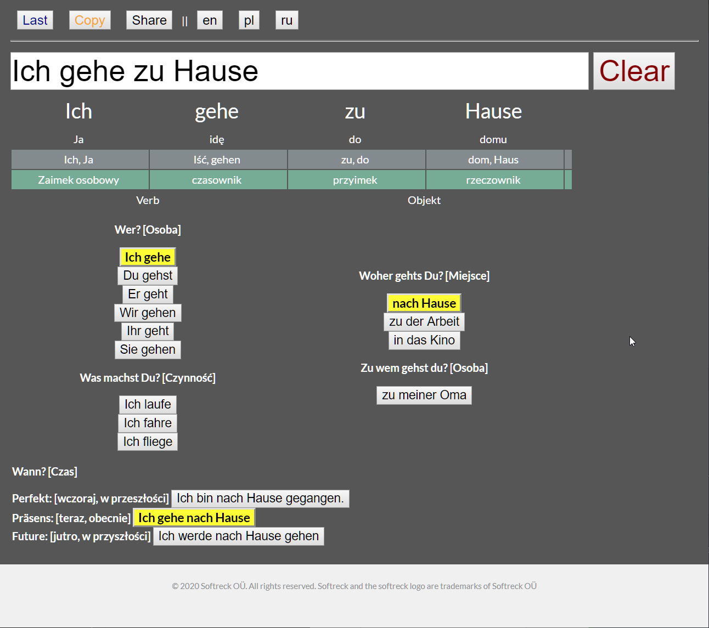
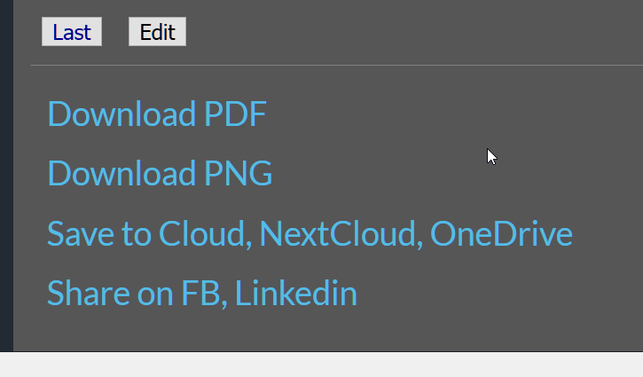

# gramatyka-de
Nauka Gramatyki Niemieckiej poprzez matrycę

## Cel projektu
Nauka gramatyki jezyka poprzez przykłady

Projekt  

matryca możliwości, trenining

Ten sam projekt dla innych języków

## Examples
gramatyka.de?Ich-gehe-zu-Hause

naukaGramatyki.pl?Ich-gehe-zu-Hause

Ich gehe zu Hause
http://gramatyka.de/index.html?Ich%20gehe%20zu%20Hause

## TODO:
Nowa Logika
1. Ostatnio edytowane
2. Edycja 
3. Zmiana 
4. Udostępnianie  

## Changelog
Wersja uproszczona

## Changes

### first view

### view with 2 pages, front

### view with 2 pages, back

### view with 2 pages, simple back, less tables, more ready to chosse options

### view with 3 pages, share functionality

## [API Foundation](https://www.apifoundation.com)

Projekt gramatyka.de jest wspierany przez [API Foundation](https://www.apifoundation.com)

Cel APIfoundation jest rozwój ekosystemu w celu szybszego wytwarzania oprogramowania

Obecnie istnieje kilka narzędzi od planowania po uruchamianie i utrzymanie oprogramowania:

+ [APIexec - executor library for shell scripts](https://www.apiexec.com)
+ [APIcra - shell scripts libraries](https://www.apicra.com)
+ [APIunit - definition of application, CI, CD](https://www.apiunit.com)
+ [APIbuild - build process definition, focused on quality, versioning](https://www.apibuild.com)
+ [APIsql - bazy danych, zapytania, modele](https://www.apisql.com)
+ [APIfunc - rozwiązania dla FaaS](https://www.apifunc.com)

## Competitors

https://github.com/langpress.com-org/

## Pricing

+ Is for free for everyone
+ If you want support us
+ If you are doing education proffesionaly and you need this kind of tool provide to your company

## What we can do:

Benefits for your customers:

What values we are bringing to your business:

## sponsors

## Solutions
Licznik zuzycia chmury, procesora i koszt

Plan, który uzywamy

## more info

About AI
[SZTUCZNA INTELIGENCJA NON-FICTION | Fundacja Panoptykon](https://panoptykon.org/sztuczna-inteligencja-non-fiction)

